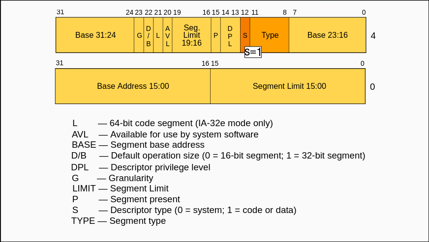
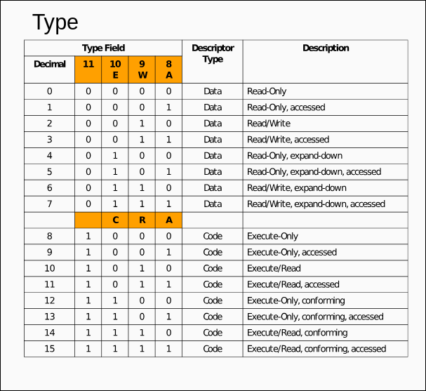
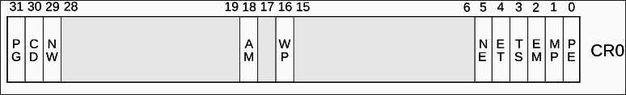
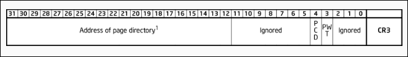
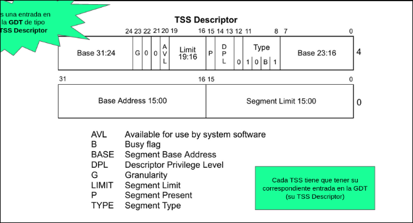

# Resumen: System Programming

Voy a hacer un resumen practico de system prgramming para poder resolver los ejercicios de forma practica y organizada:

## Posible casos de ejercicios:

- Agregar intrupcciones o syscalls al sistema:
  Para poder agregar una interrupcion al sistema los primero que debemos considerar es que tienen que tener un entrada correspondiente en la **IDT** para poder vectorizar la interrupcion/excepcion/syscall, para ello podemos usar podemos usar las macros definidas en `idt.c`:

```C
// macro para crear una interrupcion o execpcion ya que son de nivel 0
#define IDT_ENTRY0(numero)                         \
  idt[numero] = (idt_entry_t){                     \
      .offset_31_16 = HIGH_16_BITS(&_isr##numero), \
      .offset_15_0 = LOW_16_BITS(&_isr##numero),   \
      .segsel = GDT_CODE_0_SEL,                    \
      .type = INTERRUPT_GATE_TYPE,                 \
      .dpl = 0x0,                                  \
      .present = 0x1}

/*Dado un numero de de interrupcion asigna a `idt` la entrada
 * correspondiente con nivel 3 */

#define IDT_ENTRY3(numero)                         \
  idt[numero] = (idt_entry_t){                     \
      .offset_31_16 = HIGH_16_BITS(&_isr##numero), \
      .offset_15_0 = LOW_16_BITS(&_isr##numero),   \
      .segsel = GDT_CODE_0_SEL,                    \
      .type = INTERRUPT_GATE_TYPE,                 \
      .dpl = 0x3,                                  \
      .present = 0x01}
```

Tambien se debe crear el handler de interrupcion correspondiente en `isr.asm`, pequeña tabla de como se dividen las interrupciones, excepciones y syscalls:

```textplain
    | Rango     | Tipo             | Descripción general                   |
    |:----------|:-----------------|:--------------------------------------|
    | 0–31      | Excepciones      | Errores del CPU (división por cero, protección, etc.) |
    | 32–47     | Interrupciones HW| IRQs del hardware (timer, teclado, etc.) |
    | 48–255    | Syscalls         | Llamadas al sistema o interrupciones definidas por el usuario |
```

Para las isr_xx podemos crear wrappers en C para facilitar la logica de la rutina de atencion. Estos mismo wrappers nos conviene declararlos en `idt.c` y usarlos con `extern` en asm.

Otra cosa util es cuando queremos que una isr nos devulva algo por algun registro, por lo general **EAX** podemos utilizar el orden de como se guarda en la pila para poder modificarlo y que cuando se retorne al contexto, retorne el **EAX** con el resultado de la interrupcion por ejemplo un puntero.

```textplain
    | Offset (desde ESP final)  | Registro guardado | Descripción |
    |:-------------------------:|:------------------|:-------------|
    | 0x00 | EDI | Último en ser apilado |
    | 0x04 | ESI |  |
    | 0x08 | EBP |  |
    | 0x0C | ESP (original) | Valor de ESP antes de ejecutar `PUSHAD` |
    | 0x10 | EBX |  |
    | 0x14 | EDX |  |
    | 0x18 | ECX |  |
    | 0x1C | EAX | Primero en ser apilado |
```

Simplemente antes de la instruccion **POPAD** con un **mov [ESP + OFFSET]** modificamos el registro del contexto anterior en le cual queremos devolver el resultado de antender la intrrupcion, ademas podemos asumir que los argumento del wrapper o rutina de atencion no llega por algun registro. Por ejemplo **EDI**.

- Nuevo sistema de memoria:

  Para implementar un nuevo manejo de memoria va a depender de lo que quermos manejar, a grandes rasgos creo que tenemos 2 casos:

  - Memoria para dato: Si este es el caso la estructura que lleva el registro de la memoria reservada para datos nos va
    a convenir tenerlo directo en la **mmu.c**, al igual que los wrapper que se encarga de la syscall para reservar memoria si es que fuera necesario tenerla.

  - Memoria para tareas: En esta caso nos va a convenir tener las reservas en el **sched.c** para tener un facil acceso y mas si es estatico.

  Quizas tambien debamos modificar alguna exepcion ya existente como `page_fault` y nos pidan conmutar de tareas si algo falla en su rutina de antencion. Para eso debemos de poner luego del handler en la isr:

  ```ASM
      call sched_next_task

      str cx
      cmp ax, cx
      je .fin

      mov word [sched_task_selector], ax
      jmp far [sched_task_offset]
  ```

- Nueva tarea de nivel 0 o usuario:

  Para implementar nuevas tareas lo principal es plantear todos los cambios que debemos realizar a los modulos, por lo general los modulos a moficias son:

  - **GDT** en la cual debemos agregar un nuevo descriptor de **TSS**.
  - **TSS** dependiendo si la tarea a implementar es de nivel cero debemos remplazar `tss_create_user_task`, por una funcion que inicialize la **TSS** de una tarea de nivel 0 que podria llamarse `tss_create_user_task` que podria tener la siguiente implementacion.

    ```C
        tss_t tss_create_system_task(paddr_t code_start) {

    uint32_t cr3 = mmu_init_system_task_dir();

    vaddr_t stack0 = mmu_next_free_kernel_page();
    vaddr_t esp0 = stack0 + PAGE_SIZE; //Quermos que siempre la pila apunte a la direccion mas alta
    return (tss_t){
        .cr3 = cr3,
        .esp = esp0,
        .ebp = esp0,
        .eip = (vaddr_t)code_startz, //como es identity maping dir_virt = dir_phy
        .cs = GDT_CODE_0_SEL,
        .ds = GDT_DATA_0_SEL,
        .es = GDT_DATA_0_SEL,
        .fs = GDT_DATA_0_SEL,
        .gs = GDT_DATA_0_SEL,
        .ss = GDT_DATA_0_SEL,
        .ss0 = GDT_DATA_0_SEL,
        .esp0 = esp0,
        .eflags = EFLAGS_IF,
    };
    }
    ```

    La cual requiere de una nueva funcion la cual inicializa el esquema de paginacion de la tarea nivel 0, llamada `mmu_init_system_task_dir` que podria tener la siguiente implementacion:
    (Tendria que ver si tenemos que mapear la pagina de codigo o puedo ausmir que se mapea porque se encuentra en la zona de identity maping del kernel).

    ```C
    paddr_t mmu_init_killer_task_dir(/* paddr_t phy*/) {

        //Nos hacemos un nuevo cr3
        paddr_t cr3 = mmu_next_free_kernel_page();


        //Una vez que tenemos el cr3 ahora inicializamo la pd
        pd_entry_t* pd = (pd_entry_t*)(CR3_TO_PAGE_DIR(cr3));

        //Con esto copiamos el identity maping
        pd[0] = kpd[0];

        //Como el codigo de la tarea vive dentro del identity maping al mapearlo ya es accesible

        //Preguntar si esto seria correcto
        //mmu_map_page(cr3, VIRTUAL_TASK_CODE_START, phy, MMU_P);

        return cr3;
    }
    ```

    Si la tarea es de nivel 3, no es necesario hacer todas estas implementacion

  - **tasks.c** Aqui debemos definir varias cosas, si es necesario definir un nuevo tipo de tarea en **tasks.c** y agregar la direccion de inicio del codigo de la tarea en el array **task_code_start**. Si la nueva tarea es de nivel 0 debemos modificar la funcion `create_task` para que contemple el caso de la nueva tarea nivel 0 y usar las funciones definidas anterioremente en **tss.c**. Por ultimo deberiamos modificar `init_tasks` para poder inicialzar la nueva tarea.

    ```C
        /**
    * Tipos de tareas soportados por el sistema
    */
    typedef enum {
    TASK_A = 0,
    TASK_B = 1,
    // Nuevo tipo = 2 ...
    } tipo_e;

    /**
    * Array que nos permite mapear un tipo de tarea a la dirección física de su
    * código.
    */
    static paddr_t task_code_start[2] = {
        [TASK_A] = TASK_A_CODE_START,
        [TASK_B] = TASK_B_CODE_START,
     // [Nuevo_tipo] = TASK_NUEVO_TIPO_CODE_START
    };
    ```

  - **sched.c** en algunaos casos es importante agregar un nuevo estado para las tareas de usuario, para darle otra semantica a las acciones de la nueva tarea. Y en algunas casos debemos modifcar `sched_next_task` para tener en cuenta nuevos comportamientos. Tambien aumentar la cantidad de tareas del sistema para que estas nuevas puedan correr en simultaneo con las ya existentes.

  - **Implementacion de la Tarea** aqui debemos crear la tarea como cualquier otra del sistema creando la funcion `void task (void)`, con un ciclo infinito **while (true)** e implementar el comportamiento pedido.

## Funciones que pueden resultar utiles:

Aqui vamos a definir un conjunto de funciones auxiliares que pueden resultar utilies dependiendo de contexto y de que datos dispongamos:

Esta funcion sirve para conseguir el cr3 de una tarea especifica a partir de su selector.
Util para el contexto de una tarea en el que no dispongamos del cr3, de tal manera se puede
obtener con rcr3().

```C
    paddr_t task_selector_to_cr3 (uint16_t selector) {
        //Nos pasan un selector lo shifteo 3 veces a la derecha

        //Lo shifteo para obtener el indice de la gdt
        uint32_t gdt_index = (uint32_t)(selector >> 3);
        //a partir de eso obtengo el descriptor de la tss
        gdt_entry_t tss_descriptor = gdt[gdt_index];

        vaddr_t base_tss = (tss_descriptor.base_31_24 << 24)| (tss_descriptor.base_23_16 << 16) |(tss_descriptor.base_15_0);
        //armo la base de la tss
        tss_t* tss_target = (tss_t*)(base_tss);

        //Extraigo el campo del cr3
        paddr_t cr3 = tss_targer->cr3;

        return cr3;
    }
```

Esta funcion sirve para pasar de una direccion virtual a una direccion fisica en caso de que
querramos copiar el contenido de una pagina o nesecitemos mapear otra direccion virtual a
una misma pagina.

```C
    paddr_t  virt_to_phy(paddr_t cr3, vaddr_t virt) {
        //Ambas macros definidas en el tp;
        uint32_t pd_index = VIRT_PAGE_DIR(virt);
        uint32_t pt_index = VIRT_PAGE_TABLE(virt);

        //Ahora tenemos que buscar la pd y la pt, la macro fue definida en el tp
        pd_entry_t* pd = (pd_entry_t*)(CR3_TO_PAGE_DIR(cr3));

        //ahora conseguimos la pt

        pt_entry_t* pt = (pt_entry_t*)(MMU_ENTRY_PADDR(pd[pd_index].pt));


        //Conseguimos la direccion fisica de la pagina, la macro fue definida en el tp
        paddr_t phy_add = MMU_ENTRY_PADDR(pt[pt_index].page);

        return phy_add;
```

Esta funcion te retorna un puntero del descriptor especifico de la page table de proceso actual,
se puede sustituir el selector, directamente por el cr3.

```C
    pt_entry_t*  mmu_get_pt_for_task(uint16_t selector, vaddr_t virt) {
        //Uso la funcion que definie para conseguir el cr3 de la tarea
        paddr_t cr3 =  task_selector_to_cr3(selector);

        //Vamos a obtener los indices en ambas tablas
        paddr_t pd_index = VIRT_PAGE_DIR(virt);
        paddr_t pt_index = VIRT_PAGE_TABLE(virt);

        //ahora obtenemos la pd
        pd_entry_t* pd = (pd_entry_t*)(CR3_TO_PAGE_DIR(cr3));

        //ahora obtenemos la pt
        pt_entry_t* pt = (pt_entry_t)(MMU_ENTRY_PADDR(pd[pd_index].pt));


        return (pt_entry_t*) &(pt[pt_index]);
    }
}
```

## Cosas que pueden servir:

- El cr3 solo nos interesan los bits de las base de la pd, el resto son bit relacionados con la memoria cache

## Entradas de tablas y distrubicion de bits:

**Descriptor de Segmentos**:



**Tipos de Selectores de Segmentos**:



**Registro de Control CR0**:


'
'
**Registro de Control CR3**:



**Descriptor de TSS**:



## Consejos:

- 1. Siempre se pueden usar marcos, defines y variables globales definidas en el tp
- 2. Tambien no es determinante no poner las estrcuturas en el modulo correcto a menos que el enunciado lo pida.
- 3. Podemos crear las estructuras y funciones auxiliares que queremos mientras justifiquemos su propoisito (No hay que hacer nada muy entreverado).
